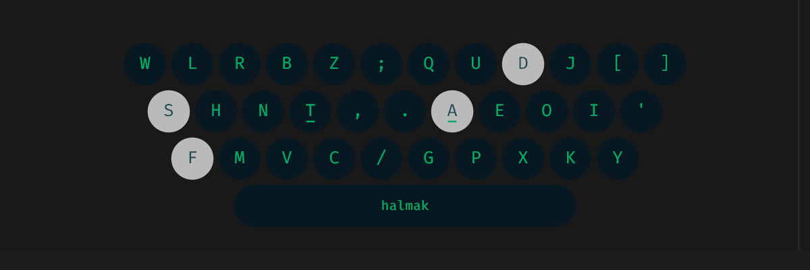
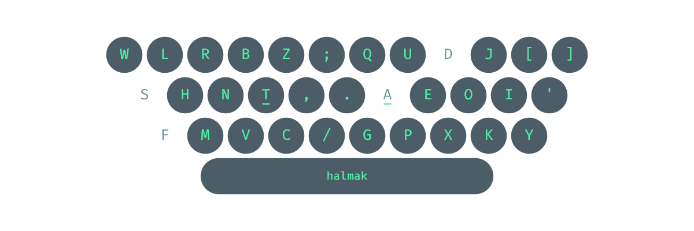
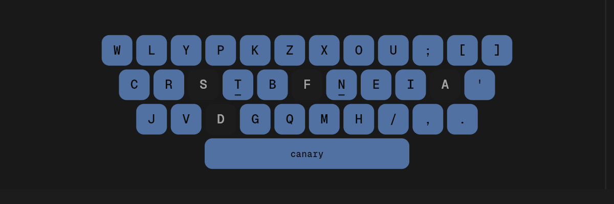
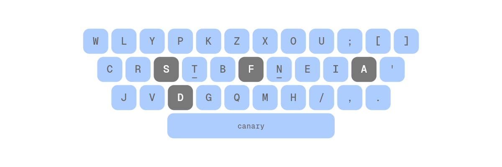
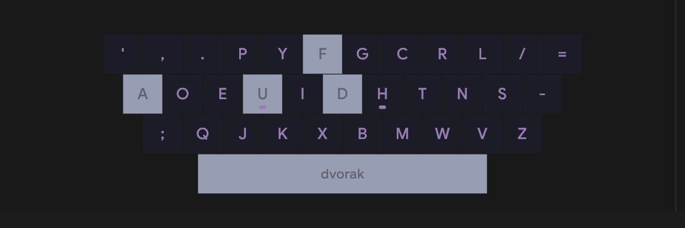
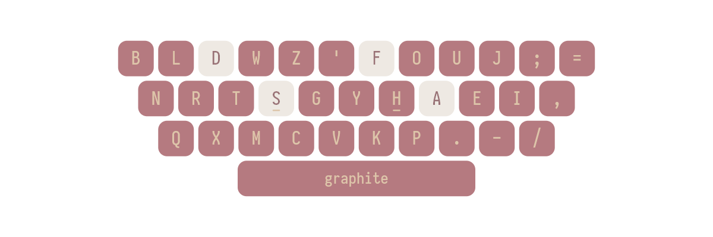

<!-- PROJECT LOGO -->
 

  
  <h1 align="center">OverKeys</h1>
  

    A customizable, open-source on-screen keyboard for alternative layouts!
     
    <a href="https://github.com/conventoangelo/OverKeys"><strong>Explore the docs »</strong></a>
     
     
    <a href="https://github.com/conventoangelo/OverKeys/releases">Download Release</a>
    ·
    <a href="https://github.com/conventoangelo/OverKeys/issues/new?labels=bug&template=bug-report---.md">Report Bug</a>
    ·
    <a href="https://github.com/conventoangelo/OverKeys/issues/new?labels=enhancement&template=feature-request---.md">Request Feature</a>
  

<!-- TABLE OF CONTENTS -->

  
Table of Contents

  <ol>
    <li><a href="#about-the-project">About The Project</a></li>
    <li><a href="#features">Features</a></li>
    <li><a href="#getting-started">Getting Started</a></li>
    <li><a href="#contributing">Contributing</a></li>
    <li><a href="#license">License</a></li>
    <li><a href="#contact">Contact</a></li>
    <li><a href="#acknowledgments">Acknowledgments</a></li>
  </ol>

<!-- ABOUT THE PROJECT -->

## About The Project

OverKeys is an open-source on-screen keyboard designed for users to practice alternative keyboard layouts, such as **Canary**, **Colemak**, **Dvorak**, and many more. Built in Flutter, it allows full customizability, making it perfect for users learning or working with non-traditional layouts.

This project was initially developed to help with system-wide practice of the **Canary layout**, but has since evolved to support multiple layouts and customization options.

### Samples

<table>
  <tr>
    <td>
      
      
Aurora (On Dark Background)

    </td>
    <td>
      
      
Aurora (On Light Background)

    </td>
  </tr>
  <tr>
    <td>
      
      
Custom (On Dark Background)

    </td>
    <td>
      
      
Custom (On Light Background)

    </td>
  </tr>
  <tr>
    <td>
      
      
Catppuccin

    </td>
    <td>
      
      
Red Samurai

    </td>
  </tr>
</table>
*Note: These themes are not provided by default and were manually configured.

(<a href="#readme-top">back to top</a>)

## Features

- **Multi-layout support**: Switch between layouts like Canary, Colemak, Dvorak, Nerps, Graphite, and more.
- **Customizable styles**: Change colors, fonts, and key styles to fit your preference.
- **Always on top**: Keep the keyboard on top of all windows for constant access.
- **Auto-hide**: The keyboard hides automatically when not in use.

(<a href="#readme-top">back to top</a>)

## Getting Started

Follow these instructions to set up OverKeys on your local machine.

### Prerequisites

- Windows OS

### Installation

1. Download the latest [EXE installer](https://github.com/conventoangelo/OverKeys/releases).
2. Run the installer and follow the on-screen instructions.
3. Once installed, OverKeys will be available for use immediately.

(<a href="#readme-top">back to top</a>)

## Contributing

Contributions are what make the open-source community such an amazing place to learn and collaborate. Any contributions to **OverKeys** are greatly appreciated.

1. Fork the Project.
2. Create your Feature Branch (`git checkout -b feature/AmazingFeature`).
3. Commit your Changes (`git commit -m 'Add some AmazingFeature'`).
4. Push to the Branch (`git push origin feature/AmazingFeature`).
5. Open a Pull Request.

(<a href="#readme-top">back to top</a>)

## License

Distributed under the GPL-3.0 License. See `LICENSE` file for more information.

(<a href="#readme-top">back to top</a>)

## Contact

### Angelo Convento

GitHub: [conventoangelo](https://github.com/conventoangelo)  
Email: <convento.angelo@gmail.com>

Project Link: [https://github.com/conventoangelo/OverKeys](https://github.com/conventoangelo/OverKeys)

(<a href="#readme-top">back to top</a>)

## Acknowledgments

- [win32](https://win32.pub/) - Access common Win32 APIs directly from Dart using FFI — no C required!
- [leanflutter.dev](https://leanflutter.dev/our-packages/)
  - [window_manager](https://pub.dev/packages/window_manager) - A plugin that allows Flutter desktop apps to resizing and repositioning the window.
  - [tray_manager](https://pub.dev/packages/tray_manager) - A plugin that allows Flutter desktop apps to defines system tray.
  - [launch_at_startup](https://pub.dev/packages/launch_at_startup) - A plugin that allows Flutter desktop apps to Auto launch on startup / login.
- [desktop_multi_window](https://pub.dev/packages/desktop_multi_window) - A flutter plugin that create and manager multi window in desktop.
- [flex_color_picker](https://github.com/rydmike/flex_color_picker) - A highly customizable Flutter color picker.
- [Best-README-Template](https://github.com/othneildrew/Best-README-Template) - An awesome README template to jumpstart your projects!
- Alaine - for the OverKeys logo.

(<a href="#readme-top">back to top</a>)

