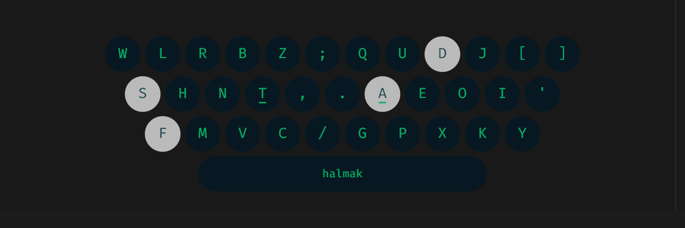
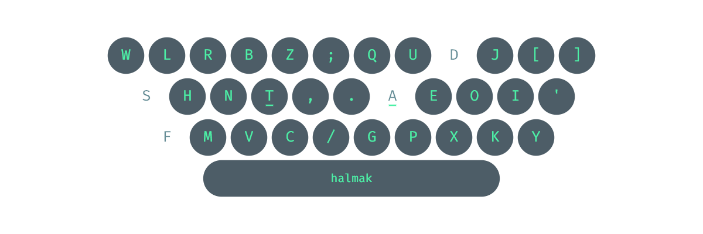
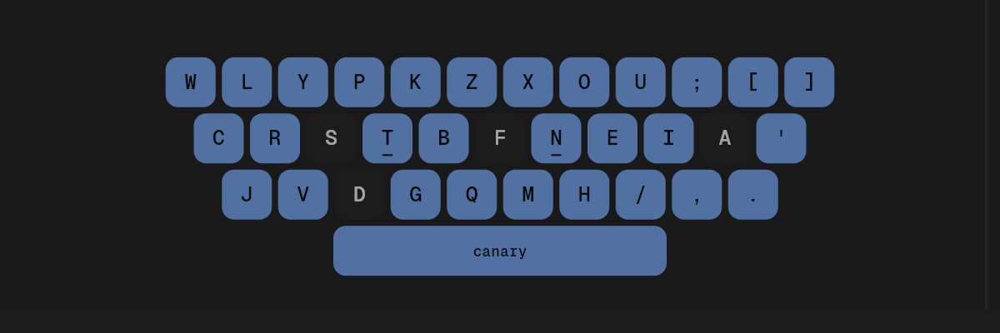
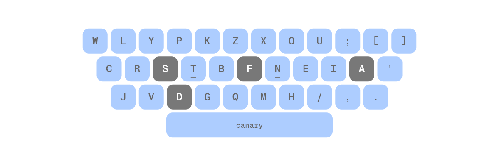
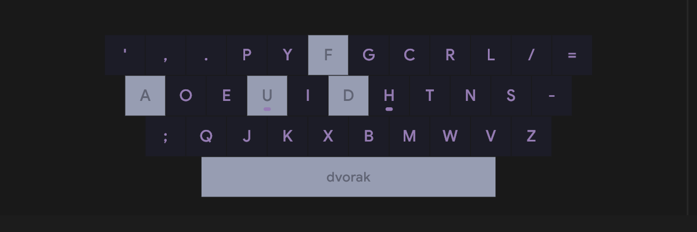
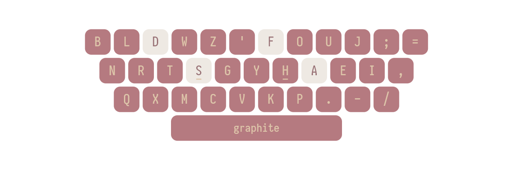
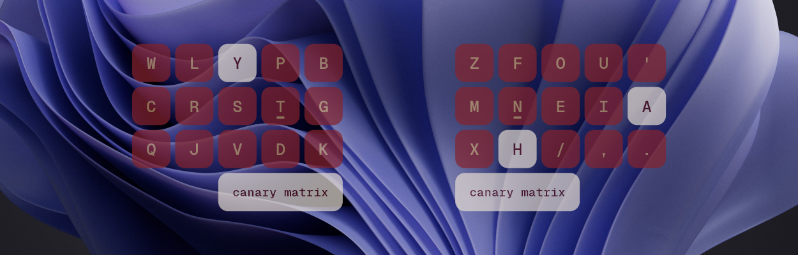
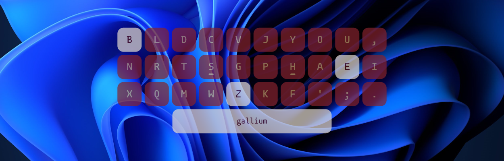

<a id="readme-top"></a>

<br />
<div align="center">
  <!-- PROJECT LOGO -->
  
  <h1 align="center">OverKeys</h1>
  
  <h3 align="center">An open-source keyboard layout visualizer for Windows</h3>

  <p align="center">
    <a href="#getting-started">Install Now</a>
    ·
    <a href="https://github.com/conventoangelo/OverKeys/issues/new?template=bug_report.md">Report Bug</a>
    ·
    <a href="https://github.com/conventoangelo/OverKeys/issues/new?template=feature_request.md">Request a Feature</a>
    ·
    <a href="https://github.com/conventoangelo/OverKeys/discussions/new?category=q-a">Ask a Question</a>
  </p>
</div>

<!-- TABLE OF CONTENTS -->
<details>
  <summary>Table of Contents</summary>
  <ol>
    <li><a href="#about-the-project">About The Project</a></li>
    <li><a href="#features">Features</a></li>
    <li><a href="#getting-started">Getting Started</a></li>
    <li><a href="#documentation">Documentation</a></li>
    <li><a href="#contributing">Contributing</a></li>
    <li><a href="#building-from-source">Building from Source</a></li>
    <li><a href="#license">License</a></li>
    <li><a href="#contact">Contact</a></li>
    <li><a href="#acknowledgments">Acknowledgments</a></li>
  </ol>
</details>

<!-- ABOUT THE PROJECT -->

## About The Project


<https://github.com/user-attachments/assets/c687a448-52b0-41bc-9b6b-07e61c2d3b31>

OverKeys is a free and open-source keyboard layout visualizer designed for users to practice alternative keyboard layouts, such as **Colemak**, **Dvorak**, **Graphite**, **Focal**, and many more. Learn and practice your layouts system-wide, personalize keyboard appearance, and improve your typing.

This project was initially developed to help with the creator's system-wide practice of the **Canary layout**, but has since evolved to support user-defined layouts, layer switching integration, and customization options.

### Samples

<table>
  <tr>
    <td>
      
      <p align="center">Aurora (On Dark Background)</p>
    </td>
    <td>
      
      <p align="center">Aurora (On Light Background)</p>
    </td>
  </tr>
  <tr>
    <td>
      
      <p align="center">Custom (On Dark Background)</p>
    </td>
    <td>
      
      <p align="center">Custom (On Light Background)</p>
    </td>
  </tr>
  <tr>
    <td>
      
      <p align="center">Catppuccin</p>
    </td>
    <td>
      
      <p align="center">Red Samurai</p>
    </td>
    </tr>
    <tr>
    <td>
      
      <p align="center">Split Matrix Style</p>
    </td>
    <td>
      
      <p align="center">Matrix Style</p>
    </td>
  </tr>
</table>
<sub>Note: The themes are not provided by default and were instead manually configured. Colors were based on the MonkeyType themes of the same name.</sub>

<p align="right">(<a href="#readme-top">back to top</a>)</p>

## Features

- **Multi-layout support**: The following layouts are currently natively supported.
  <details>
  <summary>Layouts</summary>
    <ul>
      <li>QWERTY</li>
      <li>Colemak</li>
      <li>Dvorak</li>
      <li>Canaria</li>
      <li>Canary</li>
      <li>Canary Matrix</li>
      <li>Colemak DH</li>
      <li>Colemak DH Matrix</li>
      <li>Engram</li>
      <li>Focal</li>
      <li>Gallium (Col-Stag)</li>
      <li>Gallium V2 (Row-Stag)</li>
      <li>Graphite</li>
      <li>Halmak</li>
      <li>Hands Down</li>
      <li>NERPS</li>
      <li>Norman</li>
      <li>Sturdy</li>
      <li>Sturdy Angle (Staggered)</li>
      <li>Workman</li>
      <li>Greek</li>
      <li>Arabic</li>
      <li>Russian</li>
    </ul>
  </details>
- **Customizable styles**: Change colors, fonts, sizes, offsets, and key styles
- **Auto-hide**: The keyboard hides automatically when not in use
- **Keymap styles**: Supports staggered, matrix, and split matrix (5-col and [6-col](/docs/advanced/6-column-layouts.md)) styles
- **User configurations**: Add and use [custom keyboard layouts](/docs/advanced/custom-layouts.md) through configuration files
- **Side-by-side layouts**: Display [alternative layouts](/docs/advanced/alternative-layouts.md) alongside the default layout
- **Top row/Number row**: Optional row above the main keyboard for numbers or user-configured keys
- **[Layer switching](/docs/advanced/layer-switching.md)**: Switch between multiple custom keyboard layers for QMK, ZMK, or other programmable keyboard firmware using configurable triggers and toggle modes
- **[Layer switching (Kanata)](./docs/advanced/kanata-integration.md)**: Connect to [Kanata](https://github.com/jtroo/kanata) through TCP to dynamically display the active layer
- **[Learning Mode](/docs/user-guide/learning-mode.md)**: Color-code keys based on proper finger positions for touch typing
- **[Reactive Shift Mapping](/docs/advanced/shift-mappings.md)**: Display alternate key symbols when Shift key is pressed
- **[Locales](/docs/advanced/locales.md)**: Add locale-specific keys in user configuration for key press recognition

For complete feature details, see the [documentation](docs/index.md).

<p align="right">(<a href="#readme-top">back to top</a>)</p>

## Getting Started

### Installation

OverKeys can be installed through several methods:

1. **Using Winget (Recommended)**

   ```pwsh
   winget install AngeloConvento.OverKeys
   ```

   <sub>Note: Please check if `winget` version is updated to the latest version as in the repo. Otherwise, use the [installer](https://github.com/conventoangelo/OverKeys/releases/latest) to have the latest version.</sub>

2. **Using the Installer**

   - Download and run the latest [EXE installer](https://github.com/conventoangelo/OverKeys/releases/latest).

3. **Portable Version**
   - Downloade and extract the [portable ZIP file](https://github.com/conventoangelo/OverKeys/releases/latest)

For detailed installation instructions, see the [Installation Guide](/docs/getting-started/installation.md).

<p align="right">(<a href="#readme-top">back to top</a>)</p>

## Documentation

Complete documentation for OverKeys is available in the [docs](docs/index.md) folder:

### Getting Started (Docs)

- [Installation Guide](/docs/getting-started/installation.md)
- [Basic Usage](/docs/getting-started/basic-usage.md)

### User Guide

- [Preferences](/docs/user-guide/preferences.md)
- [Learning Mode](/docs/user-guide/learning-mode.md)
- [Built-in Layouts](#features)

### Advanced Features

- [Custom Font](/docs/advanced/custom-font.md)
- [Custom Layouts](/docs/advanced/custom-layouts.md)
- [Alternative Layouts](/docs/advanced/alternative-layouts.md)
- [6-Column Layouts](/docs/advanced/6-column-layouts.md)
- [Layer Switching](/docs/advanced/layer-switching.md)
- [Kanata Integration](/docs/advanced/kanata-integration.md)
- [Shift Mappings](/docs/advanced/shift-mappings.md)
- [Supported Keys](/docs/advanced/supported-keys.md)
- [Locales](/docs/advanced/locales.md)

<p align="right">(<a href="#readme-top">back to top</a>)</p>

## Contributing

Contributions are what make the open-source community such an amazing place to learn and collaborate. Any contributions to **OverKeys** are greatly appreciated.

1. Fork the Project.
2. Create your Feature Branch (`git checkout -b feat/amazing-feature`).
3. Commit your Changes (`git commit -m 'feat: add some amazing feature'`).
4. Push to the Branch (`git push origin feat/amazing-feature`).
5. Open a Pull Request.

### Top contributors

<a href="https://github.com/conventoangelo/OverKeys/graphs/contributors">
  
</a>

## Building from Source

1. **Prerequisites**:

   - Install [Flutter](https://flutter.dev/docs/get-started/install)
   - Install [Git](https://git-scm.com/downloads/win)

2. **Clone and Build**:

   ```pwsh
   git clone https://github.com/conventoangelo/OverKeys.git
   cd OverKeys
   flutter pub get
   flutter run -d windows  # For testing
   # OR
   flutter build windows   # For release build
   # Release executable is located at `build\windows\x64\runner\Release`
   ```

<p align="right">(<a href="#readme-top">back to top</a>)</p>

## License

Distributed under the GPL-3.0 License. See `LICENSE` file for more information.

<p align="right">(<a href="#readme-top">back to top</a>)</p>

## Contact

### Angelo Convento

GitHub: [conventoangelo](https://github.com/conventoangelo)  
Email: <convento.angelo@gmail.com>

Project Link: [https://github.com/conventoangelo/OverKeys](https://github.com/conventoangelo/OverKeys)

<p align="right">(<a href="#readme-top">back to top</a>)</p>

## Acknowledgments

- [win32](https://win32.pub/) - Enable direct Win32 API access from Dart using FFI without requiring C code
- [leanflutter.dev](https://leanflutter.dev/our-packages/) - Provider of several essential Flutter desktop packages used in this project
- [desktop_multi_window](https://pub.dev/packages/desktop_multi_window) - Flutter plugin for creating and managing multiple windows in desktop applications
- [flex_color_picker](https://github.com/rydmike/flex_color_picker) - Highly customizable and versatile color picker for Flutter applications
- Alaine - for creating the beautiful OverKeys logo with love and care.

<p align="right">(<a href="#readme-top">back to top</a>)</p>
