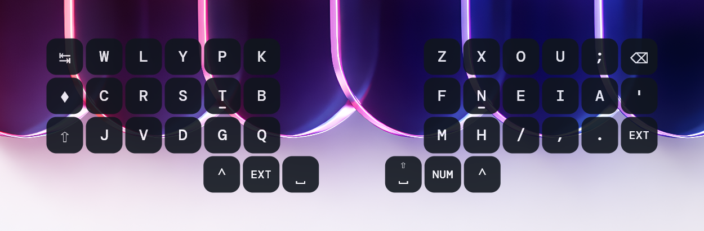
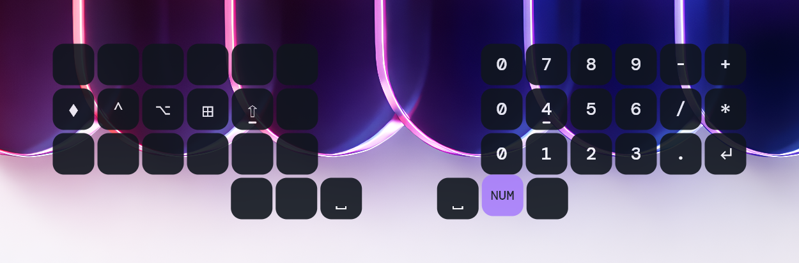

# Key Modifiers

OverKeys supports richer key entries inside custom layouts so you can show a top label, track a different underlying key, and keep certain keys visually held. This is useful for layer-style layouts, modifier keys, and layouts that need two labels on the same key. This was greatly inspired from the key modifier support in [caksoylar's keymap-drawer](https://github.com/caksoylar/keymap-drawer).

## Overview

In `userLayouts`, each key can still be a plain string. You can also use an object with these fields:

- `t`: Tracked key used for key press detection and shift mapping
- `h`: Top label shown near the top of the key
- `type`: Optional key state hint; use `held` to keep the key rendered as pressed

Plain string entries continue to work exactly as before, so you can mix both formats within the same layout.





## Example

```jsonc
{
	"userLayouts": [
		{
			"name": "Layer",
			"keys": [
				["A", { "h": "Shift", "t": "T", "type": "held" }],
				["B", "C"],
			],
		},
	],
}
```

In this example:

- `A` is rendered as a normal key
- The second key displays `Shift` at the top and `T` as the tracked key
- `type: "held"` keeps the key styled like it is active, useful for modifier keys or layer keys that should stay visually active

## Setup Instructions

### Turning the setting on

1. Open OverKeys
2. Right-click the OverKeys icon in the system tray
3. Select **Preferences**
4. Go to the **Advanced** tab
5. Toggle **Turn on advanced settings**
6. Toggle **Use user layouts** if you want the custom layout to be loaded

### Using the Configuration File

1. Right-click the OverKeys tray icon
2. Select **Preferences**
3. Go to the **Advanced** tab
4. Click **Open Config**
5. Edit the `userLayouts` array using the object form where needed
6. Save the file
7. Right-click the tray icon and click **Reload config** to apply changes

## Behavior Notes

- `t` controls the actual key OverKeys tracks for press state and alias/shift behavior
- `h` is only visual and can be omitted when you do not need a separate top label
- `held` is useful for modifier or layer keys that should stay visually active

## Troubleshooting

- If a modifier key does not display correctly, make sure the JSON object uses the exact field names `h`, `t`, and `type`
- If the tracked key is missing, OverKeys falls back to the top label or the object value when possible
- If the label looks cramped, adjust the text sizes in the [Text Settings](../user-guide/text.md) page
